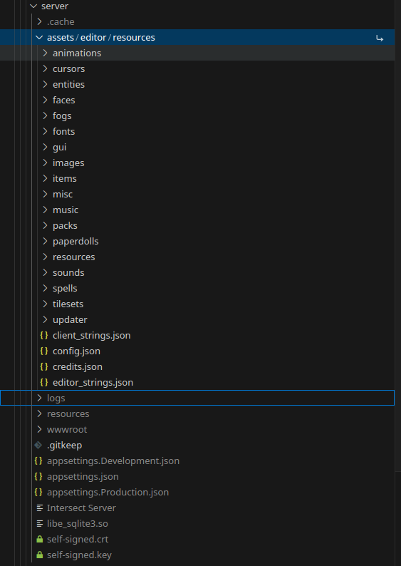

# Intersect.Server /avatar/ API (AvatarController)

Avatars are loaded from the save `entities` and `faces` directories that the Client and Editor usually use. Since the server is the one sending them, in this rare case the server actually needs the resources.

For completeness and coverage of potential future features or enhancements, please copy the _entire_ **Editor** `resources` directory (don't copy resource packs meant for the client!) to the `assets/editor` directory (you may need to create this!) in the server's working directory.

At a minimum, the `entities` and `faces` directories are required. In the future, the `paperdolls` folder will also be required.

As shown in the below screenshot, `assets` should be a _sibling_ directory to the normal `logs` and `resources` directories of the server, and the editor resources are located in `assets/editor/resources`.

