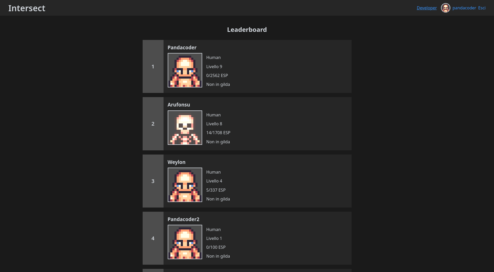

# Features

## Server

### Homepage

_**Requires the [API][API] to be enabled**_

This is a sample preview of the server built-in homepage, which includes a very basic leaderboard as well as user login/logout.

The homepage is accessible at [http://localhost:5400](http://localhost:5400) for development environments, but is also accessible at [https://localhost:5433](https://localhost:5433) (exposed as `https://*:5443` which can be reconfigured for your environment) in published release builds.

**By default the server does not have the assets to serve the in-game graphics as shown in the screenshot below, it requires a manual step. If you would like to see the in-game graphics please follow the instructions for the [AvatarController](./AvatarController/AvatarController.md).**

[API]: https://docs.freemmorpgmaker.com/en-US/api/v1/introduction/setup/